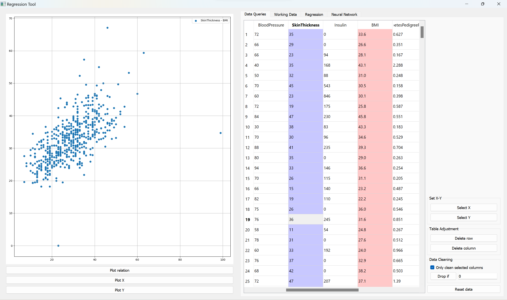

# Regression Teaching Tool (Ongoing)

The aim of this application is to provide a visualizing tool for statistic learning. As of now, this application allows you to clean, split, plot and do regression on data. It also contains a naive neural network model.

*Plotting data*

*Train test split*

*Linear regression*
